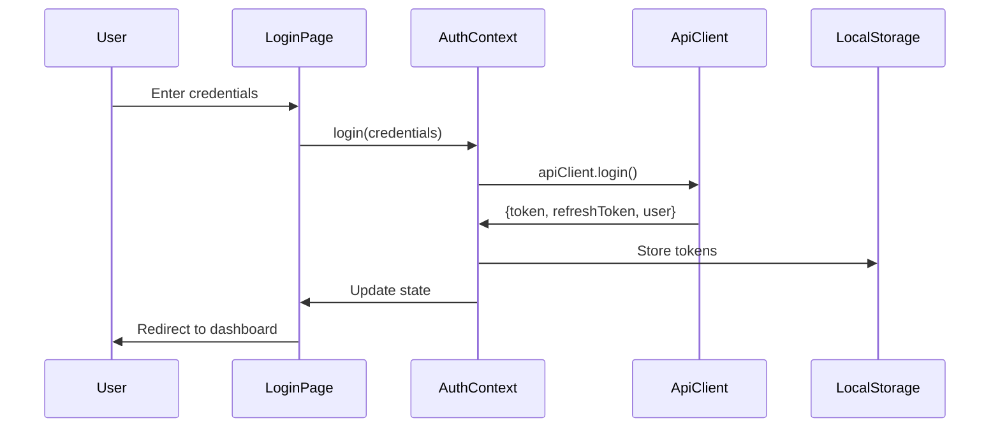
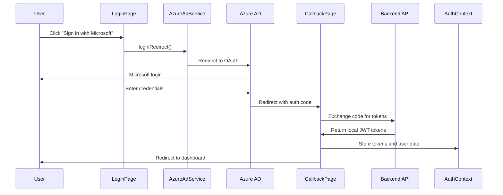

# Authentication System Documentation

The CRAFT frontend implements a comprehensive authentication system supporting both local JWT-based authentication and Azure AD Single Sign-On (SSO) with automatic token refresh, secure storage, and protected routing.

## Overview

The authentication system provides secure user authentication through multiple providers:
- **Local Authentication**: JWT-based login with username/password
- **Azure AD SSO**: Microsoft authentication with OAuth 2.0/OpenID Connect
- **Automatic Token Refresh**: Seamless session management
- **Protected Routing**: Secure access control

## Architecture

```
┌─────────────┐    ┌─────────────┐    ┌─────────────┐
│ Login Page  │───▶│ AuthContext │───▶│ API Client  │
└─────────────┘    └─────────────┘    └─────────────┘
       │                  │                  │
       ▼                  ▼                  ▼
┌─────────────┐    ┌─────────────┐    ┌─────────────┐
│ Protected   │    │ Local       │    │ Backend     │
│ Routes      │    │ Storage     │    │ API         │
└─────────────┘    └─────────────┘    └─────────────┘
                          │
                          ▼
                  ┌─────────────┐
                  │ Azure AD    │
                  │ Service     │
                  └─────────────┘
```

### Multi-Provider Support

```
┌─────────────────┐
│   Login Page    │
└─────────┬───────┘
          │
    ┌─────▼─────┐
    │   Local   │
    │   Login   │
    └───────────┘
          │
    ┌─────▼─────┐         ┌─────────────┐
    │  Azure AD │────────▶│ Microsoft   │
    │   Login   │         │   OAuth     │
    └───────────┘         └─────────────┘
```

## Components

### AuthContext

**Location**: `/src/contexts/AuthContext.tsx`

Central authentication state management using React Context API with useReducer.

#### State Interface

```typescript
interface AuthState {
  user: User | null;
  token: string | null;
  refreshToken: string | null;
  isAuthenticated: boolean;
  isLoading: boolean;
  error: string | null;
}
```

#### Actions

```typescript
type AuthAction =
  | { type: 'AUTH_START' }
  | { type: 'AUTH_SUCCESS'; payload: { user: User; token: string; refreshToken?: string } }
  | { type: 'AUTH_FAILURE'; payload: string }
  | { type: 'AUTH_LOGOUT' }
  | { type: 'CLEAR_ERROR' }
  | { type: 'SET_LOADING'; payload: boolean };
```

### Login Page

**Location**: `/src/app/login/page.tsx`

User authentication interface with form validation and error handling.

#### Features
- **Form Validation**: Email and password validation
- **Loading States**: Visual feedback during authentication
- **Error Display**: User-friendly error messages
- **Demo Credentials**: Development environment helpers
- **Azure AD Integration**: "Sign in with Microsoft" button
- **Responsive Design**: Works on all device sizes

#### Implementation

```typescript
const handleSubmit = async () => {
  if (!email || !password) return;
  
  setIsSubmitting(true);
  try {
    await login({ email, password });
    // Navigation handled by AuthContext
  } catch (error) {
    console.error('Login error:', error);
  } finally {
    setIsSubmitting(false);
  }
};
```

### Azure AD Components

**Location**: `/src/lib/azureAdService.ts` and `/src/lib/azureAdConfig.ts`

#### Azure AD Configuration

```typescript
const azureAdConfig: Configuration = {
  auth: {
    clientId: process.env.NEXT_PUBLIC_AZURE_AD_CLIENT_ID || '',
    authority: process.env.NEXT_PUBLIC_AZURE_AD_AUTHORITY || '',
    redirectUri: `${window.location.origin}/auth/callback`,
    postLogoutRedirectUri: `${window.location.origin}/login`,
  },
  cache: {
    cacheLocation: 'sessionStorage',
    storeAuthStateInCookie: false,
  },
};
```

#### Azure AD Service

```typescript
class AzureAdService {
  public async loginRedirect(): Promise<void> {
    if (!this.msalInstance) {
      throw new Error('Azure AD is not configured');
    }

    try {
      await this.msalInstance.loginRedirect(loginRequest);
    } catch (error) {
      console.error('Azure AD login redirect failed:', error);
      throw error;
    }
  }

  public async handleRedirectPromise(): Promise<AuthenticationResult | null> {
    if (!this.msalInstance) {
      return null;
    }

    try {
      const response = await this.msalInstance.handleRedirectPromise();
      return response;
    } catch (error) {
      console.error('Azure AD redirect promise handling failed:', error);
      throw error;
    }
  }
}
```

### Auth Callback Page

**Location**: `/src/app/auth/callback/page.tsx`

Handles Azure AD OAuth redirect and token exchange.

#### Features
- **OAuth Callback Handling**: Processes authorization codes
- **Error Handling**: Manages OAuth error responses
- **Token Exchange**: Communicates with backend for local token generation
- **Loading States**: Visual feedback during callback processing
- **Automatic Redirection**: Navigates to dashboard or login on completion

## Authentication Flow

### 1. Login Process



### 2. Azure AD SSO Process



### 3. Token Storage

```typescript
// Store tokens in localStorage
const setToken = (token: string): void => {
  if (typeof window !== 'undefined') {
    localStorage.setItem('token', token);
  }
};

const setRefreshToken = (refreshToken: string): void => {
  if (typeof window !== 'undefined') {
    localStorage.setItem('refreshToken', refreshToken);
  }
};
```

### 4. Automatic Token Refresh

```typescript
// API client handles automatic refresh
async refreshToken(): Promise<void> {
  const refreshToken = localStorage.getItem('refreshToken');
  
  if (!refreshToken) {
    throw new Error('No refresh token available');
  }

  const response = await this.client.post('/auth/refresh-token', {
    refreshToken,
  });

  const { token, refreshToken: newRefreshToken } = response.data;
  
  this.setToken(token);
  if (newRefreshToken) {
    localStorage.setItem('refreshToken', newRefreshToken);
  }
}
```

### 5. Protected Routes

```typescript
useEffect(() => {
  if (!isLoading && !isAuthenticated) {
    router.push('/login');
  }
}, [isAuthenticated, isLoading]);
```

## API Integration

### ApiClient Authentication Methods

**Location**: `/src/lib/api.ts`

#### Login

```typescript
async login(credentials: LoginCredentials): Promise<ApiResponse<{
  token: string;
  refreshToken?: string;
  user: User;
}>> {
  const response = await this.request({
    method: 'POST',
    url: '/auth/login',
    data: credentials,
  });

  // Store tokens automatically
  if (response.success && response.data) {
    this.setToken(response.data.token);
    if (response.data.refreshToken) {
      localStorage.setItem('refreshToken', response.data.refreshToken);
    }
  }

  return response;
}
```

#### Get Profile

```typescript
async getProfile(): Promise<ApiResponse<User>> {
  return this.request<User>({
    method: 'GET',
    url: '/auth/profile',
  });
}
```

#### Logout

```typescript
async logout(): Promise<ApiResponse> {
  try {
    await this.request({
      method: 'POST',
      url: '/auth/logout',
    });
  } finally {
    this.removeToken();
  }

  return { success: true, message: 'Logged out successfully' };
}
```

## Request Interceptors

### Adding Authorization Headers

```typescript
this.client.interceptors.request.use(
  (config) => {
    const token = this.getToken();
    if (token) {
      config.headers.Authorization = `Bearer ${token}`;
    }
    return config;
  },
  (error) => Promise.reject(error)
);
```

### Response Interceptor for Token Refresh

```typescript
this.client.interceptors.response.use(
  (response) => response,
  async (error) => {
    const originalRequest = error.config;

    if (error.response?.status === 401 && !originalRequest._retry) {
      originalRequest._retry = true;

      try {
        await this.refreshToken();
        
        const token = this.getToken();
        if (token) {
          originalRequest.headers.Authorization = `Bearer ${token}`;
        }
        
        return this.client(originalRequest);
      } catch (refreshError) {
        this.handleAuthError();
        return Promise.reject(refreshError);
      }
    }

    return Promise.reject(error);
  }
);
```

## Error Handling

### Auth Error Management

```typescript
const handleAuthError = (): void => {
  this.removeToken();
  
  // Dispatch custom event for auth error
  if (typeof window !== 'undefined') {
    window.dispatchEvent(new CustomEvent('auth:error'));
  }
};

// Listen for auth errors in AuthContext
useEffect(() => {
  const handleAuthError = () => {
    dispatch({ type: 'AUTH_LOGOUT' });
  };

  if (typeof window !== 'undefined') {
    window.addEventListener('auth:error', handleAuthError);
    
    return () => {
      window.removeEventListener('auth:error', handleAuthError);
    };
  }
}, []);
```

### Error Display in UI

```typescript
{error && (
  <Alert severity="error" sx={{ mb: 3 }} onClose={clearError}>
    {error}
  </Alert>
)}
```

## Security Features

### Token Storage Security

```typescript
// Check if running in browser environment
const getToken = (): string | null => {
  if (typeof window !== 'undefined') {
    return localStorage.getItem('token');
  }
  return null;
};
```

### Request ID Tracking

```typescript
private generateRequestId(): string {
  return `req_${Date.now()}_${Math.random().toString(36).substr(2, 9)}`;
}

// Added to all requests
config.headers['X-Request-ID'] = this.generateRequestId();
```

### CORS Configuration

```typescript
const apiConfig: ApiClientConfig = {
  baseURL: process.env.NEXT_PUBLIC_API_URL || 'http://localhost:3001/api/v1',
  timeout: 30000,
  withCredentials: false, // Using JWT tokens instead of cookies
};
```

## State Management

### AuthContext Provider

```typescript
export function AuthProvider({ children }: { children: ReactNode }) {
  const [state, dispatch] = useReducer(authReducer, initialState);

  const value: AuthContextType = {
    ...state,
    login,
    register,
    logout,
    checkAuth,
    clearError,
  };

  return (
    <AuthContext.Provider value={value}>
      {children}
    </AuthContext.Provider>
  );
}
```

### useAuth Hook

```typescript
export function useAuth(): AuthContextType {
  const context = useContext(AuthContext);
  if (context === undefined) {
    throw new Error('useAuth must be used within an AuthProvider');
  }
  return context;
}
```

## Usage Examples

### Login Form

```typescript
const { login, isLoading, error, clearError } = useAuth();

const handleLogin = async (credentials: LoginCredentials) => {
  try {
    await login(credentials);
    router.push('/dashboard');
  } catch (error) {
    // Error handled by AuthContext
  }
};
```

### Protected Page

```typescript
const { isAuthenticated, isLoading, user } = useAuth();

if (isLoading) {
  return <CircularProgress />;
}

if (!isAuthenticated) {
  router.push('/login');
  return null;
}

return <DashboardContent user={user} />;
```

### Logout

```typescript
const { logout } = useAuth();

const handleLogout = async () => {
  try {
    await logout();
    router.push('/');
  } catch (error) {
    console.error('Logout error:', error);
  }
};
```

## Environment Configuration

### Environment Variables

```env
# API Configuration
NEXT_PUBLIC_API_URL=http://localhost:3001/api/v1
NEXT_PUBLIC_APP_URL=http://localhost:3002

# Azure AD SSO (Optional)
NEXT_PUBLIC_AZURE_AD_CLIENT_ID=your-azure-ad-client-id
NEXT_PUBLIC_AZURE_AD_AUTHORITY=https://login.microsoftonline.com/your-tenant-id

# Environment
NODE_ENV=development
```

### Demo Credentials

```typescript
// Available in development mode
const demoCredentials = [
  { email: 'admin@example.com', password: 'Admin123!' },
  { email: 'user@example.com', password: 'User123!' },
  { email: 'manager@example.com', password: 'Manager123!' },
];
```

## Testing

### Unit Tests

```typescript
describe('AuthContext', () => {
  test('should login successfully', async () => {
    const { result } = renderHook(() => useAuth(), {
      wrapper: AuthProvider,
    });

    await act(async () => {
      await result.current.login({
        email: 'test@example.com',
        password: 'password123',
      });
    });

    expect(result.current.isAuthenticated).toBe(true);
    expect(result.current.user).toBeDefined();
  });
});
```

### Integration Tests

```typescript
describe('Login Flow', () => {
  test('should navigate to dashboard after successful login', async () => {
    render(<LoginPage />);
    
    fireEvent.change(screen.getByLabelText(/email/i), {
      target: { value: 'admin@example.com' },
    });
    
    fireEvent.change(screen.getByLabelText(/password/i), {
      target: { value: 'Admin123!' },
    });
    
    fireEvent.click(screen.getByRole('button', { name: /sign in/i }));
    
    await waitFor(() => {
      expect(mockRouter.push).toHaveBeenCalledWith('/dashboard');
    });
  });
});
```

## Troubleshooting

### Common Issues

1. **Token Expiry**: Ensure refresh token logic is working
2. **CORS Errors**: Check API URL configuration
3. **Storage Issues**: Verify localStorage availability
4. **Redirect Loops**: Check authentication state management

### Debug Tips

```typescript
// Enable auth debugging
console.log('Auth State:', {
  isAuthenticated,
  isLoading,
  user: user?.email,
  hasToken: !!localStorage.getItem('token'),
});
```

## Best Practices

1. **Secure Token Storage**: Use httpOnly cookies for production
2. **Error Handling**: Provide meaningful error messages
3. **Loading States**: Show appropriate loading indicators
4. **State Cleanup**: Clear auth state on logout
5. **Token Validation**: Validate tokens on app initialization

## Future Enhancements

- **Biometric Authentication**: Fingerprint/Face ID
- **Multi-Factor Authentication**: SMS/Email verification  
- **Session Management**: Active session monitoring
- **Remember Me**: Persistent login option
- **Additional SSO Providers**: Google, GitHub, SAML
- **Conditional Access**: Location and device-based policies

## Azure AD Setup

For detailed Azure AD configuration instructions, see:
- [Complete Azure AD SSO Setup Guide](../../docs/AZURE_AD_SSO.md)

### Quick Setup Steps

1. **Register Application in Azure AD**
2. **Configure Environment Variables**
3. **Test SSO Integration**
4. **Deploy with HTTPS for Production**

The Azure AD integration provides:
- **Seamless Authentication**: No separate password required
- **Enterprise Security**: Leverages existing Azure AD policies
- **User Provisioning**: Automatic account creation
- **Role Mapping**: Default role assignment with admin override